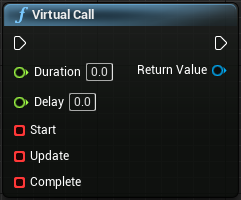
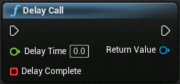
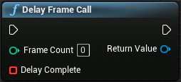
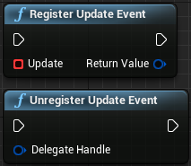
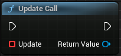
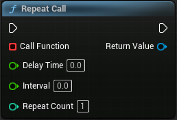

LTween provide some handy functions for work:

**VirtualCall**- Register the start/update/complete events, set a duration time, so these events will execute:



**DelayCall**- Same as engine's native node "Delay":

c++ version may be more valuable:
```c++
ULTweenBPLibrary::DelayCall(World, 2.0f, [](){
    ...(your function here)
});
```

**DelayFrameCall**- Delay a specific frame count and call event:




*(DEPRECATED) **RegisterUpdateEvent | UnregisterUpdateEvent**- Register the "Update" event so it will be executed every frame, until unregistered.*  



**UpdateCall**- Call event every frame.  


**RepeatCall**- Repeatly call function with given interval time:


