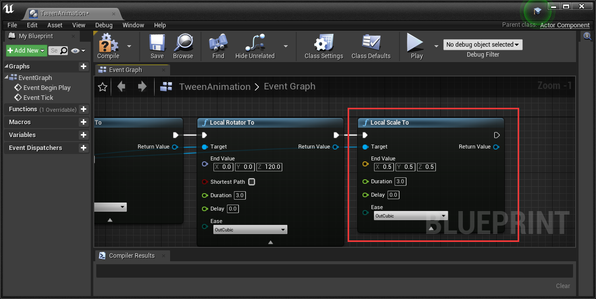
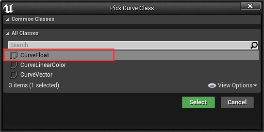
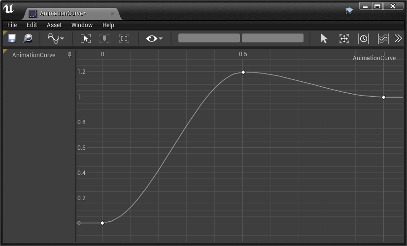
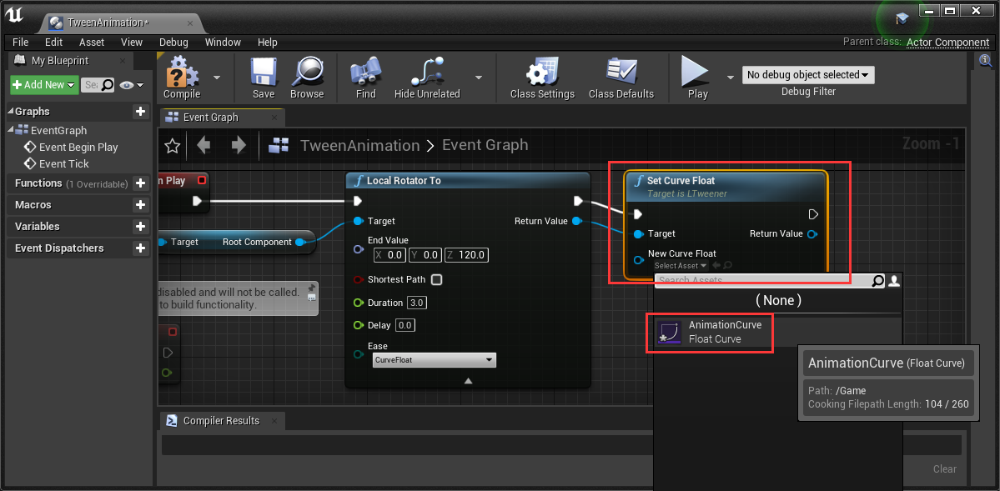
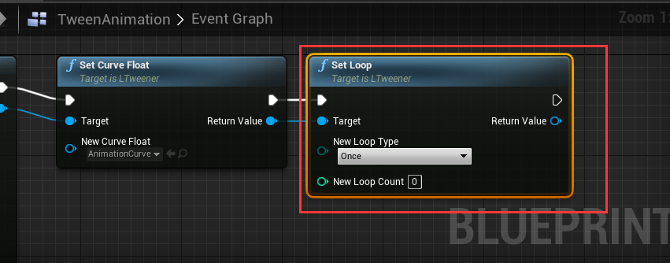
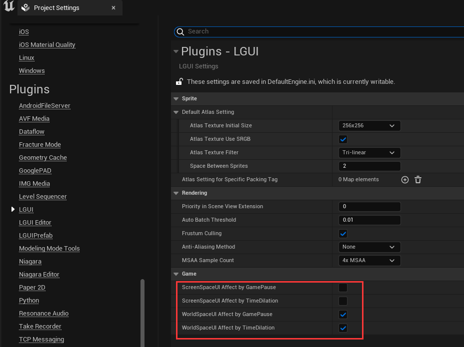
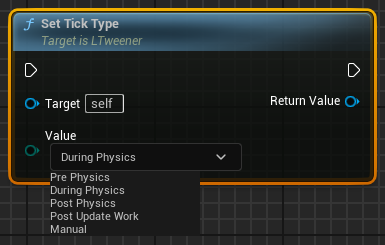
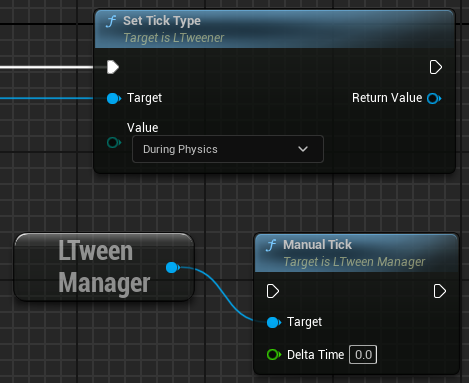

# LTween

**NOTE!!!** LTween is part of LGUI plugin as an individual module, if you already have LGUI then no need to buy LTween!

LTween (Lex-Tween) is a easy & fast & efficient tween animation library for UnrealEngine.  

Here is a video tutorial: [Youtube](https://youtu.be/m0-aYP8zRSw?si=Nlnroc-a3TEiZiqT) [Bilibili](https://www.bilibili.com/video/BV1Ey4y1Q7tM/?share_source=copy_web&vd_source=b22254760c9a0522c8caea62e5327c1d)

---

# Use LTween for SceneComponent

## Move/Rotate/Scale Animation
Create a new default level, drag a cube to viewport, set mobility to movable, set location to (0, 0, 80):  

Create a ActorComponent blueprint, name it "TweenAnimation":  

Edit the TweenAnimation blueprint like this, this will move the cube's relative location.x to the "EndValue":  

Drag the TweenAnimation blueprint to the cube and hit play, the cube will move to (500, 0, 80) in 0.5 seconds:  

The animation looks very simple, lets make it a little interesting. Double click to Open TweenAnimation blueprint, change "Duration" to 3.0. Add a "Local Rotator To" node like this:  

Hit play, the cube will move and rotate in viewport:  

Add a "Local Scale To" node like this, then hit play and see the animation:  

You can find other tween functions in "LTween" category:  

## Delay and Ease
Delete "Local Position X To" and "Local Scale To" node, keep "Local Rotator To" node, and set "Delay" to 1.0, hit play (the animation will start after 1 seconds when play):  

LTween provides severial ease types, click "Ease" and select the type you want. [This site](https://www.inkfood.com/tween-3d-objects/) could be a good reference about ease functions (image is also from site https://www.inkfood.com/tween-3d-objects/):  

  
### CurveFloat
There is a special ease type called "CurveFloat":  

This can let us use a CurveFloat to control our animation.  

The following steps will show you how to do it:  
Right click on empty area of Content, choose "Miscellaneous"->"Curve":  

Select "CurveFloat" in the popup window:  

Name created asset to "AnimationCurve":  

LTween will use horizontal range from 0 to 1 as start and end time, keep that in mind and make the curve to any type you want:  

Open "TweenAnimation" blueprint, drag out "Return Value" of "Local Rotator To" node, and add a new node "Set Curve Float", and choose "AnimationCurve" in "New Curve Float", this will make the CurveFloat work:  

## Loop
Loop is one of the most important thing of a tween animation.  
After the "Set Curve Float" node, Drag out "Return Value" and add a new node "Set Loop":  

Click "New Loop Type" and you will find 4 options:  
- **Once**: No loop  
- **Restart**: Each loop cycle restarts from beginning  
- **Yoyo**: The tween move forward and backward at alternate cycles  
- **Incremental**: Continuously increments the tween at the end of each loop cycle (A to B, B to B+(A-B), and so on)  

Don't forget to set "New Loop Count", 0 or 1 means no loop, -1 means infinite loop.  

## GamePause and TimeDilation
Normally when set GamePause, tween animation will also pause; and when set TimeDilation, tween animation will affected by dilated-time too. But sometimes we don't want that, we want our tween animation still process when set GamePause, or still use real-time when set TimeDilation. So the two properties is good for this condition:  
- **SetAffectByGamePause**: Will this tween be affected when set GamePause? Default is true, means when GamePause this tween will pause too, false means this tween will still process if GamePause.  
- **SetAffectByTimeDilation**: Will this tween be affected by TimeDilation? Default is true, means the tween will use dilated-time, false means the tween will use real-time.  

### CAUTION!!!
For LGUI's ScreenSpaceUI element, if create tween with it's own function (eg. UIItem.WidthTo), then it will automatically call SetAffectByGamePause(false) and SetAffectByTimeDilation(false), so UI will not affect by these two things (just like UMG). This can be change by changing LGUISettings:
  
Same thing for UMG.  

## TickType
When create a new tweener, the animation will execute within TickingGroup::DuringPhysics, this is also the default TickingGroup of Actor and ActorComponent.  
We can also change tween animation's ticking group by calling **SetTickType**:

The parameters **PrePhysics DuringPhysics PostPhysics PostUpdateWork** is just like UE's default TickingGroup.  

The last one **Manual** is special, it allow us to use our own tick. We can call **ManualTick** function to do the tick:

## Events
Event function is also a can't-missing feature in tween animation.
LTween provide these events:  
- **OnStart**: Execute when animation start, if the tween have delay, then execute after delay  
- **OnUpdate**: Execute every frame if is tweening  
- **OnComplete**: Execute when animation complete, if the tween have loop, then execute after all loop. If is infinite loop then not execute at all
- **OnCycleStart**: Exeucte every loop cycle start  
- **OnCycleComplete**: Exeucte every loop cycle complete  
Setup event function is easy. eg OnUpdate, drag out the "Return Value" and add new node "On Update", drag out "New Update" and add a custom event, the event will execute every frame after animation start:  

## Functions
- **Pause/Resume**: Pause/Resume this animation  
- **Restart**: Restart animation  
- **Goto**: Send the tween to the given position in time  
- **Kill/KillIfIsTweening**: Kill the tween if the animation already start  
- **ForceComplete**: Force complete this animation at this frame, call OnComplete  
- **IsTweening**: Is the tween animation processing?
- **GetLoopCycleCount**: Get the tween animation loop cycle count
- **GetProgress**: Get the tween progress in range 0 1

## Use LTween for Material

LTween provide "Material Vector Parameter To" and "Material Scalar Parameter To" nodes for "Material Instance Dynamic" objects:  

