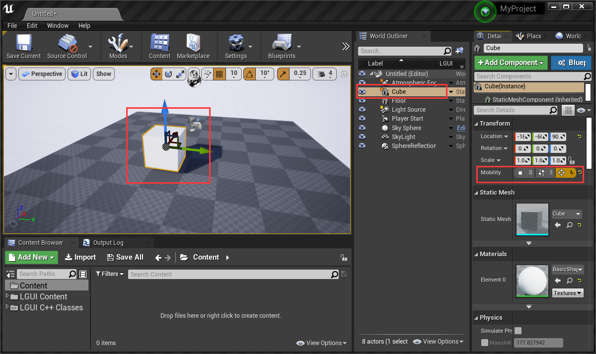

# 创建自定义的补间动画
LTween提供了通用的补间动画方法："Float To", "Int To", "Vector2 To", "Vector3 To", "Vector4 To", "Color To", "LinearColor To", "Quaternion To", "Rotator To"。

我们来举个例子，用“Rotator To”来旋转个Cube。

## 设置场景
创建个新的默认场景，创建个Cube，设为可移动，设置位置为（0, 0, 80）：

创建个ActorComponent蓝图，命名为“TweenAnimation”：

把“TweenAnimation”组件挂到Cube上：

从“Event Begin Play”拉出线然后添加“Rotator To”节点：

## 设置"Setter"参数
**"Setter"是LTween的设置事件，LTween会从“Start Value”和“End Value”计算出插值，然后用“Setter”事件来调用和传递计算出来的值。**

从“Setter”拖拽出线然后创建自定义事件，那么蓝图会自动创建个带Rotator类型参数的事件：

按照下图设置事件：

## 设置其他参数
从“Root Component”拖拽出线然后选择“Get Relative Rotation”，然后连到“Start Value”：

设置“End Value”为（0, 0, 90），“Duration”为3.0，设置“Delay”为1.0：

设置完成，可以运行查看动画效果了。