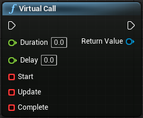
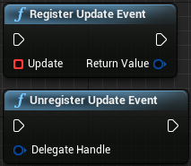
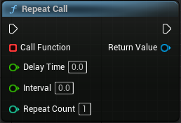

LTween提供了一些好用的函数：

**VirtualCall**- 注册Start/Update/Complete事件，设置时长（duration），然后事件就会按照要求执行：


**DelayCall**- 与引擎自带的“Delay”节点有相同的功能：

c++版本可能会更常用：
```c++
ULTweenBPLibrary::DelayCall(World, 2.0f, [](){
    ...(your function here)
});
```

**DelayFrameCall**- 延迟特定帧数后执行事件：


**RegisterUpdateEvent | UnregisterUpdateEvent**- 注册“Update”事件用以每帧都调用事件，直到取消注册：


**RepeatCall**- 以给定的间隔重复执行函数：

