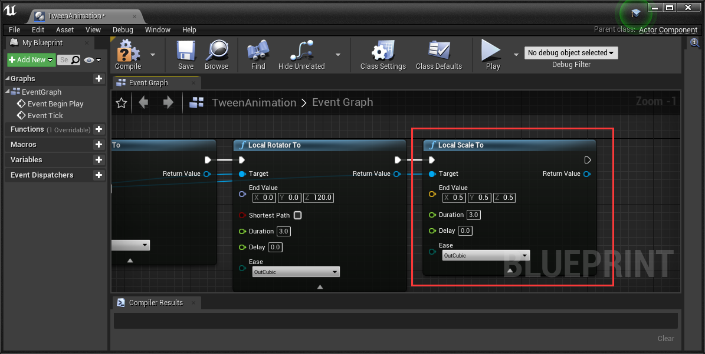

# LTween

**NOTE!!!** LTween是LGUI插件中的一个模块，如果你已经有了LGUI插件那么就不需要再购买LTween！  

LTween (Lex-Tween) 是个用于虚幻引擎中的简单、快速、高效的补间动画工具。  

Here is a video tutorial: [Youtube](https://youtu.be/m0-aYP8zRSw?si=Nlnroc-a3TEiZiqT) [Bilibili](https://www.bilibili.com/video/BV1Ey4y1Q7tM/?share_source=copy_web&vd_source=b22254760c9a0522c8caea62e5327c1d)

---

# 对SceneComponent使用LTween

## 移动/旋转/缩放 动画
创建个新的默认场景，创建个Cube，设置为可移动，设置位置到（0, 0, 80）：

创建个ActorComponent蓝图，命名为“TweenAnimation”：

编辑TweenAnimation蓝图，按照下图添加“Local Position X To”节点，这样将会把Cube的局部位置的x轴移动到“EndValue”：

拖拽TweenAnimation蓝图到Cube然后运行，可以看到Cube在0.5秒钟移动到位置（500, 0, 80）：

这个动画非常简单，我们可以弄得更有趣点。双击TweenAnimation打开蓝图编辑器，修改“Duration”为3.0，像下图这样添加个“Local Rotator To”节点：

运行可以看到Cube会移动和旋转：

像下图一样添加个“Local Scale To”节点，运行看看动画：

你也可以找到其他的动画节点，都在“LTween”分类里：

## 延迟和缓动
删除“Local Position X To”和“Local Scale To”节点，保留“Local Rotator To”节点，设置“Delay”为1.0，运行（动画将会在点击运行之后1秒钟开始）：

LTween提供了多个缓动类型，点击“Ease”然后选择你需要的缓动类型。[这个帖子](https://www.inkfood.com/tween-3d-objects/)可以看到关于缓动函数曲线的信息（图片也是从这个站点获取的）：

  
### CurveFloat
有个特殊的缓动类型叫做“CurveFloat”：

“CurveFloat”可以让我们用个曲线来控制我们的动画。
后面的步骤将会告诉你如何使用“CurveFloat”。右键单击Content的空白处，选择“Miscellaneous”->“Curve”：

在弹出窗口里选择“CurveFloat”：

命名为“AnimationCurve”：

LTween用曲线的水平方向的0-1范围作为时间，记住这一点然后你可以制作出你想要的任何的曲线用于动画：

打开“TweenAnimation”蓝图，从“Local Rotator To”节点的“Return Value”拖拽出线，添加个“Set Curve Float”节点，然后在“New Curve Float”选择“AnimationCurve”：

## 循环
循环是补间动画中最重要的功能点之一。
从“Set Curve Float”节点的“Return Value”拖出线然后添加节点“Set Loop”：

点击“New Loop Type”出现4个选项：
- **Once** 不循环  
- **Restart** 每次循环都重新开始
- **Yoyo** 动画正向和反向交替
- **Incremental** 每次动画结束都以上一次的结束值为开始值来增长（A到B，B到B+(A-B)...）

别忘了要设置“New Loop Count”，0或1代表没有循环，-1代表无限循环。

## 事件
事件也是补间动画系统中一个非常重要的功能。
LTween提供这些事件：
- **OnStart** 当动画开始的时候执行，如果动画有延迟，那么当延迟结束之后才会执行
- **OnUpdate** 动画过程中每一帧都执行
- **OnComplete** 当动画结束的时候执行，如果动画有循环，那么在所有循环结束之后执行。如果是无限循环那么就不会执行。
- **OnCycleStart** 每次循环开始的时候执行
- **OnCycleComplete** 每次循环结束的时候执行
设置事件很简单，比如OnUpdate，可以从“Return Value”拖出线然后添加“On Update”节点，从“New Update”拖出线并添加自定义事件，这个添加的事件将会在动画开始后每帧都执行：

## 函数
- **Pause/Resume** 暂停/继续动画  
- **Restart** 重新开始动画  
- **Goto** 把动画设置到指定时间点  
- **Kill/KillIfIsTweening** 强制结束动画  
- **ForceComplete** 强制把动画设置为结束  

## 在材质中使用LTween

LTween提供了“Material Vector Parameter To”和“Material Scalar Parameter To”节点用于“Material Instance Dynamic”物体：

