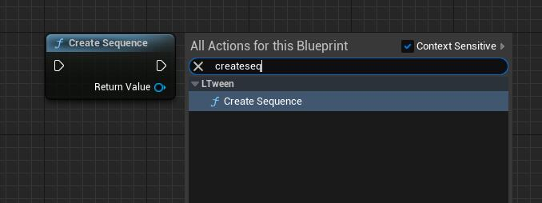
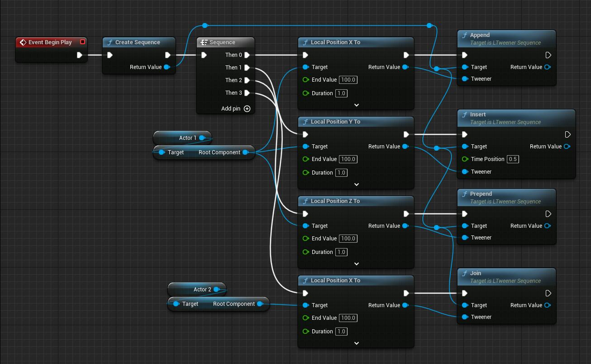
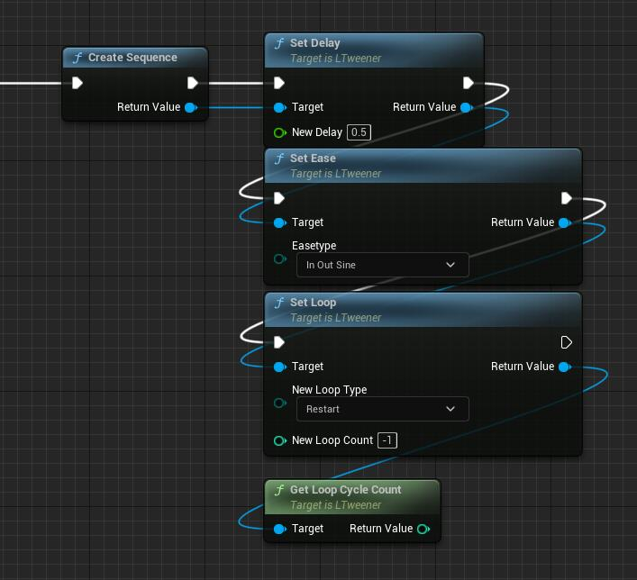
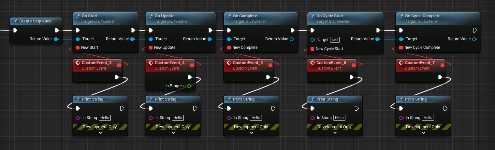
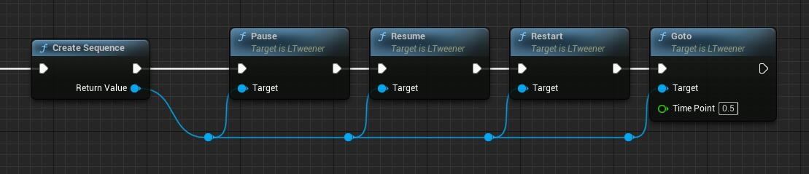

# LTweenerSequence（动画序列）
LTweenerSequence是一种特殊的补间动画类型，它可以控制一组其他补间动画。首先，它是个补间动画，所以它继承了一般补间动画都有的属性和函数。它也有它自己独特的属性和函数。

## 函数
```c++
/**
 * Adds the given tween to the end of the Sequence.
 * Not support Tweener type: Delay/ DelayFrame/ Virtual.
 * Has no effect if the Sequence has already started.
 */
ULTweenerSequence* Append(UObject* WorldContextObject, ULTweener* tweener);
/**
 * Adds the given interval to the end of the Sequence.
 * Has no effect if the Sequence has already started.
 * @param interval The interval duration
 */
ULTweenerSequence* AppendInterval(UObject* WorldContextObject, float interval);
/**
 * Inserts the given tween at the given time position in the Sequence, automatically adding an interval if needed.
 * Not support Tweener type: Delay/ DelayFrame/ Virtual.
 * Has no effect if the Sequence has already started.
 * @param timePosition The time position where the tween will be placed
 */
ULTweenerSequence* Insert(UObject* WorldContextObject, float timePosition, ULTweener* tweener);
/**
 * Adds the given tween to the beginning of the Sequence, pushing forward the other nested content.
 * Not support Tweener type: Delay/ DelayFrame/ Virtual.
 * Has no effect if the Sequence has already started.
 */
ULTweenerSequence* Prepend(UObject* WorldContextObject, ULTweener* tweener);
/**
 * Adds the given interval to the beginning of the Sequence, pushing forward the other nested content.
 * Has no effect if the Sequence has already started.
 * @param interval The interval duration
 */
ULTweenerSequence* PrependInterval(UObject* WorldContextObject, float interval);
/**
 * Inserts the given tween at the same time position of the last tween added to the Sequence.
 * Note that, in case of a Join after an interval, the insertion time will be the time where the interval starts, not where it finishes.
 * Not support Tweener type: Delay/ DelayFrame/ Virtual.
 * Has no effect if the Sequence has already started.
 */
ULTweenerSequence* Join(UObject* WorldContextObject, ULTweener* tweener);
```
## 如何使用
### 创建个LTweenerSequence
C++：
```c++
auto Sequence = ULTweenBPLibrary::CreateSequence(this);
```
蓝图：  
在LTween分类里找到**Create Sequence**节点

### 添加其他动画
C++：
```c++
Sequence->Append(this, ULTweenBPLibrary::LocalPositionXTo(Actor1->GetRootComponent(), 100, 1.0f));
Sequence->Insert(this, 0.5f, ULTweenBPLibrary::LocalPositionYTo(Actor1->GetRootComponent(), 100, 1.0f));
Sequence->Prepend(this, ULTweenBPLibrary::LocalPositionZTo(Actor1->GetRootComponent(), 100, 1.0f));
Sequence->Join(this, ULTweenBPLibrary::LocalPositionXTo(Actor2->GetRootComponent(), 100, 1.0f));
```
蓝图：

### 属性，事件，函数
**属性：**  
C++：
```c++
Sequence->SetDelay(0.5f);
Sequence->SetEase(LTweenEase::InOutSine);
Sequence->SetLoop(LTweenLoop::Restart, -1);
Sequence->GetLoopCycleCount();
```
蓝图：

**事件：**  
C++：
```c++
Sequence->OnStart([=]{...});
Sequence->OnUpdate([=](float progress){...});
Sequence->OnComplete([=]{...});
Sequence->OnCycleStart([=]{...});
Sequence->OnCycleComplete([=]{...});
```
蓝图：

**函数：**  
C++：
```c++
Sequence->Pause();
Sequence->Resume();
Sequence->Restart();
Sequence->Goto(0.5f);
```
蓝图：

